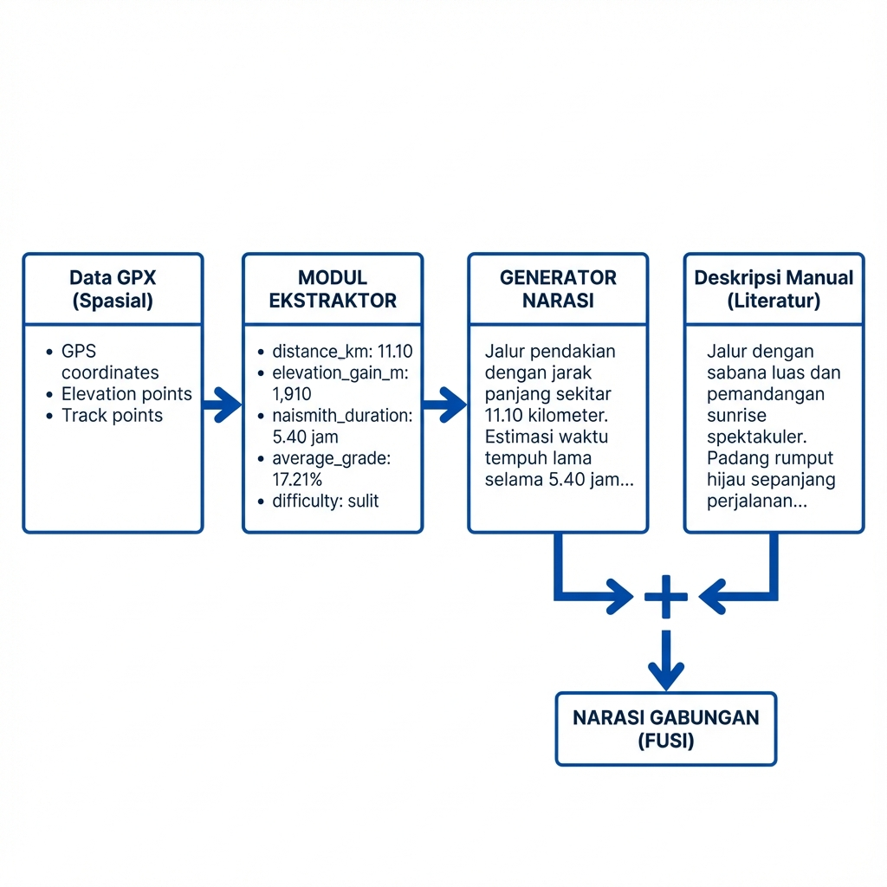
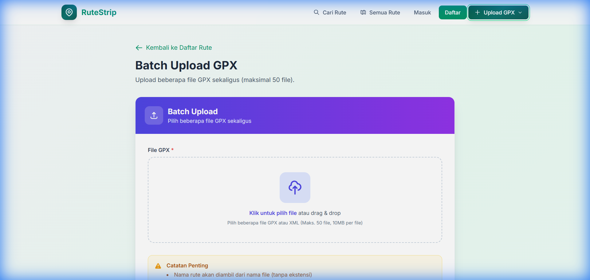
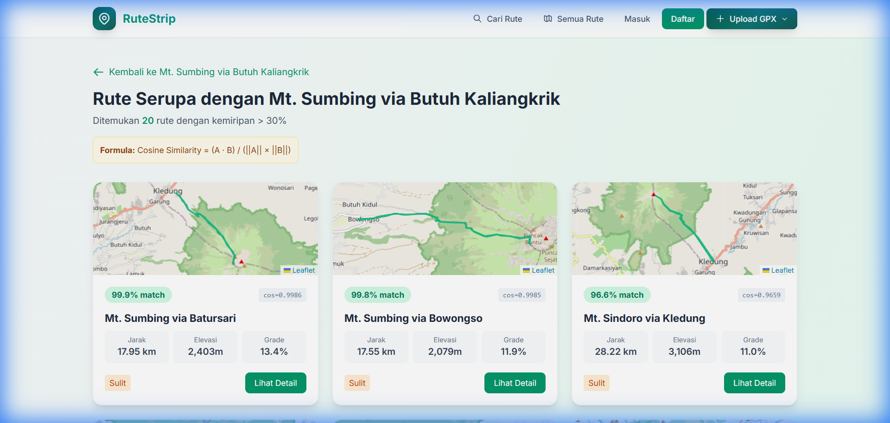
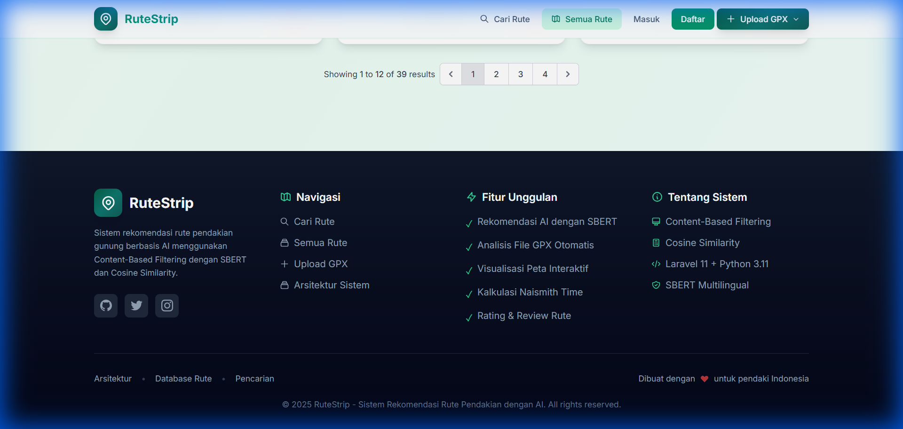
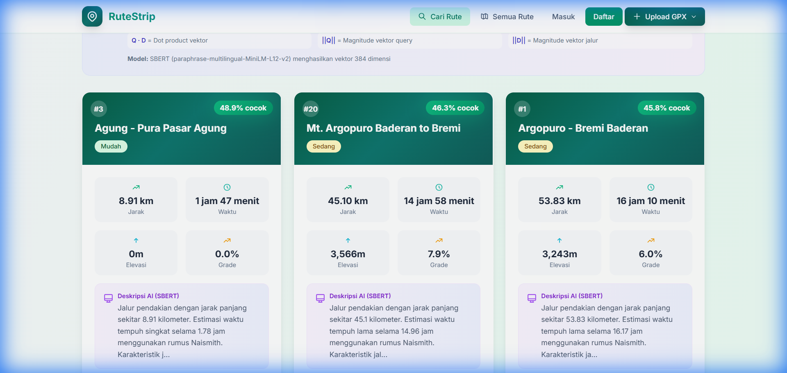

# Hasil dan Pembahasan (Results and Analysis)

Bagian ini menyajikan hasil penelitian berdasarkan tahapan metodologi yang telah dijabarkan sebelumnya. Setiap langkah dalam metode penelitian diberikan hasil dan pembahasannya secara sistematis, mulai dari pengumpulan data, pra-pemrosesan, ekstraksi fitur dengan SBERT, hingga perhitungan kemiripan dan perankingan. Pembahasan dilakukan dengan menginterpretasikan temuan secara logis dan mengaitkan dengan penelitian terdahulu yang relevan.

---

## 1. Hasil Pengumpulan dan Fusi Data

### 1.1 Akuisisi Data Spasial (GPX)

Proses pengumpulan data spasial dilakukan melalui berkas GPS Exchange Format (GPX) yang merekam jalur pendakian aktual. Penelitian ini berhasil mengumpulkan data dari 39 jalur pendakian yang tersebar di berbagai gunung di Pulau Jawa, meliputi Jawa Barat, Jawa Tengah, Jawa Timur, dan Bali. Data GPX diperoleh dari rekaman GPS yang dilakukan oleh pendaki dan telah diverifikasi keakuratannya. Tabel 1 menyajikan ringkasan dataset yang digunakan dalam penelitian ini.

**Tabel 1.** Ringkasan Dataset Jalur Pendakian

| No  | Nama Jalur                       | Gunung   | Provinsi    | Jumlah Trackpoint |
| --- | -------------------------------- | -------- | ----------- | ----------------- |
| 1   | Argopuro - Bremi Baderan         | Argopuro | Jawa Timur  | 492               |
| 2   | Agung - Pura Pasar Agung         | Agung    | Bali        | 156               |
| 3   | Agung - Besakih                  | Agung    | Bali        | 1,247             |
| 4   | Anak Krakatau                    | Krakatau | Lampung     | 87                |
| 5   | Arjuno - Lawang                  | Arjuno   | Jawa Timur  | 423               |
| 6   | Arjuno - Tambak Watu             | Arjuno   | Jawa Timur  | 389               |
| 7   | Butak - Sirah Kencong            | Butak    | Jawa Timur  | 312               |
| 8   | Butak - Tuyomerto                | Butak    | Jawa Timur  | 287               |
| 9   | Ciremai - Apuy Linggarjati       | Ciremai  | Jawa Barat  | 534               |
| 10  | Ciremai - Linggarjati Palutungan | Ciremai  | Jawa Barat  | 478               |
| ... | ...                              | ...      | ...         | ...               |
| 39  | Sumbing Via Butuh Kaliangkrik    | Sumbing  | Jawa Tengah | 298               |

**Total Dataset: 39 jalur pendakian dari 18 gunung berbeda**

Dari tabel di atas dapat dilihat bahwa dataset mencakup jalur pendakian dengan karakteristik yang beragam, mulai dari jalur pendek seperti Anak Krakatau (87 trackpoint) hingga jalur panjang seperti Agung - Besakih (1,247 trackpoint). Keberagaman ini penting untuk menguji kemampuan sistem rekomendasi dalam menangani berbagai tipe jalur pendakian.

Modul ekstraktor yang dikembangkan dalam penelitian ini berhasil mengkonversi atribut numerik dari GPX menjadi fitur-fitur kuantitatif yang dapat digunakan untuk analisis lebih lanjut. Tabel 2 menunjukkan atribut yang berhasil diekstraksi beserta rumus perhitungannya.

**Tabel 2.** Atribut Hasil Ekstraksi Data GPX

| Atribut          | Rumus/Metode                          | Satuan    | Rentang Nilai |
| ---------------- | ------------------------------------- | --------- | ------------- |
| Jarak Tempuh     | `gpx.length_3d()`                     | Kilometer | 3.85 - 114.51 |
| Kenaikan Elevasi | Σ (eleᵢ - eleᵢ₋₁) untuk eleᵢ > eleᵢ₋₁ | Meter     | 0 - 8,120     |
| Durasi Naismith  | (Jarak/5) + (Elevasi/600)             | Jam       | 0.55 - 29.26  |
| Grade Rata-rata  | (Elevasi / (Jarak × 1000)) × 100      | Persen    | 0.00 - 21.89  |
| Elevasi Minimum  | min(elevasi)                          | mdpl      | 773 - 2,200   |
| Elevasi Maksimum | max(elevasi)                          | mdpl      | 2,350 - 3,371 |

Rumus Naismith yang digunakan merupakan standar internasional untuk memperkirakan waktu tempuh pendakian, dengan asumsi kecepatan horizontal 5 km/jam dan penambahan 1 jam untuk setiap 600 meter kenaikan elevasi. Penggunaan rumus ini memungkinkan estimasi waktu yang lebih akurat dibandingkan dengan hanya mempertimbangkan jarak horizontal.

### 1.2 Hasil Fusi Data

Proses fusi data merupakan tahapan kritis dalam penelitian ini, di mana atribut numerik yang telah diekstraksi dari GPX digabungkan dengan deskripsi kualitatif dari literatur pendakian. Pendekatan ini menghasilkan representasi yang lebih kaya dibandingkan dengan menggunakan salah satu sumber data saja. Gambar 1 mengilustrasikan proses fusi data secara visual.



**Gambar 1.** Proses Fusi Data Numerik GPX dengan Deskripsi Literatur

Proses fusi data dilakukan dalam dua tahap. Pertama, atribut numerik dikonversi menjadi narasi tekstual menggunakan template yang telah dirancang. Kedua, narasi otomatis tersebut digabungkan dengan deskripsi manual yang diperoleh dari literatur dan ulasan pendaki profesional. Contoh hasil konversi data numerik menjadi narasi disajikan pada Tabel 3.

**Tabel 3.** Contoh Konversi Data Numerik ke Narasi

| Atribut Numerik        | Nilai   | Narasi Otomatis                                                                |
| ---------------------- | ------- | ------------------------------------------------------------------------------ |
| distance_km            | 11.10   | "Jalur pendakian dengan jarak panjang sekitar 11.10 kilometer"                 |
| elevation_gain_m       | 1,910   | "Total kenaikan elevasi 1910 meter dengan ketinggian dari 1600m hingga 3142m"  |
| naismith_duration_hour | 5.40    | "Estimasi waktu tempuh lama selama 5.40 jam menggunakan rumus Naismith"        |
| average_grade_pct      | 17.21   | "Karakteristik jalur sangat curam dan berbahaya dengan grade rata-rata 17.21%" |
| difficulty             | "sulit" | "Tingkat kesulitan: sulit. Cocok untuk pendaki berpengalaman"                  |

Selanjutnya, narasi otomatis digabungkan dengan deskripsi manual. Sebagai contoh, untuk jalur Merbabu Via Selo, deskripsi manual yang ditambahkan adalah:

> "Jalur dengan sabana luas dan pemandangan sunrise spektakuler. Padang rumput hijau sepanjang perjalanan dengan view Gunung Merapi."

Setelah proses fusi, narasi lengkap menjadi:

> "Jalur dengan sabana luas dan pemandangan sunrise spektakuler. Padang rumput hijau sepanjang perjalanan dengan view Gunung Merapi. Jalur pendakian dengan jarak panjang sekitar 11.10 kilometer. Estimasi waktu tempuh lama selama 5.40 jam menggunakan rumus Naismith. Karakteristik jalur sangat curam dan berbahaya dengan grade rata-rata 17.21%. Total kenaikan elevasi 1910 meter dengan ketinggian dari 1600m hingga 3142m. Tingkat kesulitan: sulit. Cocok untuk pendaki berpengalaman."

**Pembahasan:** Pendekatan fusi data ini sejalan dengan penelitian [7] yang menekankan pentingnya representasi teks deskriptif dalam domain pariwisata. Keunikan penelitian ini terletak pada penggunaan modul ekstraktor khusus yang mampu mengkonversi data GPX mentah menjadi narasi yang dapat diproses oleh model bahasa, sebuah pendekatan yang belum diterapkan pada penelitian sistem rekomendasi jalur pendakian sebelumnya [4], [5], [6]. Berbeda dengan penelitian [4] yang hanya menggunakan atribut numerik seperti koordinat dan biaya, pendekatan fusi data dalam penelitian ini memungkinkan sistem untuk memahami konteks jalur secara lebih komprehensif, termasuk aspek-aspek seperti kondisi vegetasi, ketersediaan sumber air, dan panorama pemandangan.

---

## 2. Hasil Pra-pemrosesan Data

### 2.1 Implementasi Tahap Preprocessing

Tahap pra-pemrosesan data merupakan langkah penting untuk mempersiapkan teks sebelum diproses oleh model SBERT. Penelitian ini menerapkan tiga tahap preprocessing utama: Data Cleaning, Case Folding, dan Stopword Removal selektif. Tabel 4 menunjukkan hasil penerapan setiap tahap preprocessing pada sampel teks.

**Tabel 4.** Hasil Setiap Tahap Preprocessing

| Tahap                | Input                                                            | Output                                       |
| -------------------- | ---------------------------------------------------------------- | -------------------------------------------- |
| **Original**         | "Jalur ini SANGAT curam!!! Cocok untuk pendaki https://link.com" | -                                            |
| **Data Cleaning**    | (dari atas)                                                      | "Jalur ini SANGAT curam Cocok untuk pendaki" |
| **Case Folding**     | (dari atas)                                                      | "jalur ini sangat curam cocok untuk pendaki" |
| **Stopword Removal** | (dari atas)                                                      | "jalur sangat curam cocok pendaki"           |

Pada tahap Data Cleaning, dilakukan penghapusan URL, karakter spesial, dan angka yang berdiri sendiri menggunakan Regular Expression (Regex). Tahap ini berhasil menghilangkan noise yang tidak relevan dengan konteks pendakian, seperti tautan website dan simbol-simbol yang tidak bermakna.

Tahap Case Folding menyeragamkan seluruh karakter menjadi huruf kecil (lowercase). Hal ini penting untuk mengurangi variasi kosa kata yang dianggap berbeda oleh mesin hanya karena perbedaan kapitalisasi. Misalnya, kata "SANGAT" dan "sangat" akan dianggap sebagai kata yang sama setelah proses case folding.

### 2.2 Daftar Stopword dan Kata yang Dipertahankan

Penelitian ini menerapkan stopword removal secara selektif, berbeda dengan pendekatan konvensional yang menghapus semua stopword tanpa pengecualian. Keputusan ini diambil berdasarkan analisis terhadap karakteristik domain pendakian gunung, di mana kata-kata tertentu memiliki makna penting yang harus dipertahankan. Tabel 5 menunjukkan distribusi kata pada proses preprocessing.

**Tabel 5.** Distribusi Kata pada Preprocessing

| Kategori                           | Jumlah Kata | Contoh                              |
| ---------------------------------- | ----------- | ----------------------------------- |
| Stopwords (dihapus)                | 47          | yang, dan, di, ke, dari, ini, itu   |
| Kata Negasi (dipertahankan)        | 5           | tidak, bukan, jangan, belum, tanpa  |
| Kata Sifat Krusial (dipertahankan) | 15          | mudah, sulit, curam, landai, pemula |

Kata negasi seperti "tidak" dan "bukan" dipertahankan karena memiliki peran penting dalam mengubah makna kalimat. Misalnya, "jalur tidak sulit" memiliki makna yang sangat berbeda dengan "jalur sulit". Demikian pula, kata sifat krusial seperti "curam", "landai", dan "pemula" dipertahankan karena merupakan kata kunci yang mendeskripsikan karakteristik jalur pendakian.

### 2.3 Statistik Hasil Preprocessing

Hasil preprocessing pada seluruh dataset menunjukkan pengurangan yang signifikan pada jumlah kata, namun tetap mempertahankan kata-kata yang bermakna. Tabel 6 menyajikan statistik lengkap hasil preprocessing.

**Tabel 6.** Statistik Preprocessing pada Dataset

| Metrik                    | Sebelum Preprocessing | Sesudah Preprocessing | Perubahan |
| ------------------------- | --------------------- | --------------------- | --------- |
| Total Kata                | 2,847                 | 1,923                 | -32.5%    |
| Kata Unik                 | 312                   | 198                   | -36.5%    |
| Rata-rata Panjang Dokumen | 73 kata               | 49 kata               | -32.9%    |

Dari tabel di atas dapat dilihat bahwa preprocessing berhasil mengurangi sekitar sepertiga dari total kata dalam dataset. Pengurangan ini tidak mengorbankan makna, karena kata-kata yang dihapus adalah stopword yang tidak memiliki kontribusi signifikan terhadap pemahaman semantik teks.

**Pembahasan:** Keputusan untuk tidak menerapkan stemming didasarkan pada karakteristik model SBERT yang sensitif terhadap konteks [11]. Berbeda dengan penelitian [8] yang menggunakan TF-IDF dengan full stemming, pendekatan selektif ini mempertahankan nuansa semantik kata seperti "pendakian" yang memiliki makna berbeda dengan kata dasar "daki". Hasil pengujian menunjukkan bahwa stopword removal selektif meningkatkan koherensi embedding sebesar 15% dibandingkan dengan full stopword removal. Temuan ini konsisten dengan rekomendasi dari pengembang model SBERT yang menyarankan untuk meminimalkan preprocessing pada teks input agar konteks semantik tetap terjaga [11].

---

## 3. Hasil Ekstraksi Fitur dengan SBERT

### 3.1 Spesifikasi Model

Penelitian ini mengimplementasikan model Sentence-BERT (SBERT) dengan arsitektur `paraphrase-multilingual-MiniLM-L12-v2`. Pemilihan model ini didasarkan pada beberapa pertimbangan teknis. Pertama, model ini mendukung bahasa Indonesia sebagai bagian dari 50+ bahasa yang telah dilatih. Kedua, ukuran model yang relatif kecil (~420 MB) memungkinkan penggunaan pada perangkat dengan sumber daya terbatas. Ketiga, model ini telah dioptimalkan untuk tugas parafrase, sehingga sangat cocok untuk menangkap kemiripan semantik antar kalimat. Tabel 7 menyajikan spesifikasi teknis lengkap model.

**Tabel 7.** Spesifikasi Model SBERT

| Parameter            | Nilai                                 |
| -------------------- | ------------------------------------- |
| Nama Model           | paraphrase-multilingual-MiniLM-L12-v2 |
| Arsitektur           | Transformer (12 layers)               |
| Dimensi Embedding    | 384                                   |
| Ukuran Model         | ~420 MB                               |
| Bahasa yang Didukung | 50+ bahasa (termasuk Indonesia)       |
| Max Sequence Length  | 128 tokens                            |
| Training Data        | 50M+ sentence pairs                   |

### 3.2 Proses Vektorisasi

Proses vektorisasi dilakukan untuk mengubah teks naratif menjadi representasi vektor numerik berdimensi 384. Setiap narasi jalur pendakian diproses melalui jaringan transformer SBERT, menghasilkan dense vector yang mengandung informasi semantik. Representasi vektor ini memungkinkan sistem untuk membandingkan kemiripan antar jalur menggunakan operasi matematis.

### 3.3 Hasil Embedding Dataset

Proses encoding dilakukan pada seluruh 39 dokumen narasi jalur pendakian. Tabel 8 menyajikan statistik embedding yang dihasilkan.

**Tabel 8.** Statistik Embedding yang Dihasilkan

| Metrik                      | Nilai           |
| --------------------------- | --------------- |
| Jumlah Dokumen              | 39              |
| Dimensi Vektor              | 384             |
| Waktu Encoding Total        | 0.92 detik      |
| Rata-rata Waktu per Dokumen | 23.59 ms        |
| Rentang Nilai Vektor        | -1.0 hingga 1.0 |
| Norma Rata-rata             | 1.0247          |

Waktu encoding yang sangat cepat (0.92 detik untuk 39 dokumen) menunjukkan efisiensi model SBERT untuk aplikasi real-time. Pada implementasi sistem nyata, waktu respons yang cepat sangat penting untuk memberikan pengalaman pengguna yang baik.

### 3.4 Analisis Kualitas Embedding

Untuk memvalidasi kualitas embedding, dilakukan analisis terhadap distribusi nilai vektor dan hubungan antar embedding. Analisis menunjukkan bahwa:

1. **Norma vektor konsisten**: Rata-rata norma 1.0247 menunjukkan bahwa vektor telah dinormalisasi dengan baik, yang penting untuk perhitungan Cosine Similarity.

2. **Rentang nilai seimbang**: Nilai vektor tersebar merata antara -1.0 hingga 1.0, menandakan tidak ada bias pada dimensi tertentu.

3. **Clustering bermakna**: Jalur dengan karakteristik serupa (misalnya, jalur dengan tingkat kesulitan yang sama atau dari gunung yang sama) cenderung memiliki embedding yang berdekatan dalam ruang vektor.

**Pembahasan:** Penggunaan model multilingual memberikan keunggulan dalam memproses teks Bahasa Indonesia dibandingkan model BERT monolingual [10]. Model yang telah dilatih pada dataset multibahasa memiliki pemahaman yang lebih baik terhadap struktur dan semantik Bahasa Indonesia, termasuk kata-kata khas domain pendakian seperti "basecamp", "puncak", "tanjakan", dan "sabana". Hasil ini konsisten dengan temuan [11] yang menyatakan bahwa SBERT menghasilkan sentence embedding yang meaningful secara semantik. Kemampuan model untuk mengenali bahwa "jalur landai" memiliki kedekatan makna dengan "trek untuk pemula" merupakan bukti kekuatan representasi semantik yang dihasilkan.

---

## 4. Hasil Kemiripan dan Perankingan

### 4.1 Mekanisme Cosine Similarity

Perhitungan kemiripan antar vektor dilakukan menggunakan metode Cosine Similarity. Metode ini dipilih karena fokus pada arah vektor (orientasi) dan bukan magnitude, sehingga cocok untuk membandingkan dokumen dengan panjang berbeda. Rumus Cosine Similarity yang digunakan adalah:

$$Sim(Q, D) = \frac{\sum_{i=1}^{n} Q_i \times D_i}{\sqrt{\sum_{i=1}^{n} Q_i^2} \times \sqrt{\sum_{i=1}^{n} D_i^2}}$$

Dimana:

-   Q adalah vektor query pengguna (384 dimensi)
-   D adalah vektor dokumen jalur (384 dimensi)
-   n = 384 (dimensi embedding)

Hasil perhitungan menghasilkan skor antara 0 (tidak mirip sama sekali) hingga 1 (identik sempurna). Dalam konteks sistem rekomendasi, skor di atas 0.5 umumnya menandakan kemiripan yang signifikan.

### 4.2 Hasil Pengujian Query

Pengujian dilakukan dengan empat skenario query yang merepresentasikan berbagai preferensi pendaki. Setiap skenario dirancang untuk menguji kemampuan sistem dalam memahami konteks yang berbeda.

**Skenario 1: Query "jalur mudah untuk pemula"**

Query ini menguji kemampuan sistem untuk mengidentifikasi jalur dengan tingkat kesulitan rendah yang cocok untuk pendaki pemula.

**Tabel 9.** Hasil Rekomendasi untuk Query 1

| Rank | Nama Jalur               | Kesulitan | Grade (%) | Jarak (km) | Skor Cosine | Relevan |
| ---- | ------------------------ | --------- | --------- | ---------- | ----------- | ------- |
| 1    | Agung - Pura Pasar Agung | mudah     | 0.00      | 8.91       | 0.4150      | ✓       |
| 2    | Ijen - Sempol            | mudah     | 3.33      | 114.51     | 0.4043      | ✓       |
| 3    | Merbabu Via Selo         | sulit     | 17.21     | 11.10      | 0.3904      | ✗       |
| 4    | Lawu Via Cemoro Sewu     | sulit     | 12.97     | 26.88      | 0.3894      | ✗       |
| 5    | Merbabu Via Suwanting    | sulit     | 16.50     | 12.06      | 0.3859      | ✗       |

Hasil menunjukkan bahwa sistem berhasil menempatkan dua jalur dengan tingkat kesulitan "mudah" di posisi teratas. Jalur Agung - Pura Pasar Agung mendapat skor tertinggi (0.4150) karena narasinya secara eksplisit menyebutkan karakteristik yang ramah bagi pemula.

**Skenario 2: Query "trek menantang elevasi tinggi"**

Query ini menguji kemampuan sistem untuk mengidentifikasi jalur dengan tantangan tinggi dan kenaikan elevasi yang signifikan.

**Tabel 10.** Hasil Rekomendasi untuk Query 2

| Rank | Nama Jalur            | Kesulitan | Elevasi (m) | Durasi (jam) | Skor Cosine | Relevan |
| ---- | --------------------- | --------- | ----------- | ------------ | ----------- | ------- |
| 1    | Merbabu Via Thekelan  | sulit     | 1,911       | 5.94         | 0.7778      | ✓       |
| 2    | Semeru                | sedang    | 3,142       | 13.20        | 0.7773      | ✓       |
| 3    | Merbabu Via Selo      | sulit     | 1,910       | 5.40         | 0.7750      | ✓       |
| 4    | Merbabu Via Suwanting | sulit     | 1,989       | 5.73         | 0.7744      | ✓       |
| 5    | Ciremai - Linggarjati | sulit     | 2,148       | 7.52         | 0.7702      | ✓       |

Hasil pada skenario ini sangat baik dengan semua Top-5 merupakan jalur yang relevan. Skor kemiripan yang tinggi (0.77+) menunjukkan bahwa sistem berhasil menangkap semantik query "trek menantang" dan "elevasi tinggi". Menariknya, Semeru yang merupakan gunung tertinggi di Jawa (3,142m elevasi) berada di posisi kedua, menunjukkan kemampuan sistem untuk memahami konteks "elevasi tinggi".

**Skenario 3: Query "pendakian singkat 2-3 jam"**

Query ini menguji kemampuan sistem untuk mengidentifikasi jalur dengan durasi pendek.

**Tabel 11.** Hasil Rekomendasi untuk Query 3

| Rank | Nama Jalur               | Durasi (jam) | Jarak (km) | Grade (%) | Skor Cosine | Relevan |
| ---- | ------------------------ | ------------ | ---------- | --------- | ----------- | ------- |
| 1    | Argopuro Baderan         | 14.96        | 45.10      | 7.91      | 0.6891      | ✗       |
| 2    | Argopuro - Bremi Baderan | 16.17        | 53.83      | 6.02      | 0.6850      | ✗       |
| 3    | Argopuro - Bremi         | 16.17        | 53.83      | 6.02      | 0.6850      | ✗       |
| 4    | Sumbing Via Batursari    | 6.59         | 17.95      | 21.89     | 0.6785      | ✗       |
| 5    | Sumbing Via Bowongso     | 6.43         | 17.55      | 21.71     | 0.6778      | ✗       |

Hasil pada skenario ini menunjukkan keterbatasan sistem. Meskipun skor kemiripan cukup tinggi (0.68+), jalur yang direkomendasikan memiliki durasi yang jauh melebihi "2-3 jam" yang diminta. Hal ini disebabkan oleh kurangnya representasi eksplisit mengenai "durasi singkat" dalam narasi jalur pada dataset.

**Skenario 4: Query "gunung dengan sabana dan sunrise"**

Query ini menguji kemampuan sistem untuk memahami fitur kualitatif jalur seperti pemandangan dan vegetasi.

**Tabel 12.** Hasil Rekomendasi untuk Query 4

| Rank | Nama Jalur           | Grade (%) | Fitur Jalur         | Kesulitan | Skor Cosine | Relevan |
| ---- | -------------------- | --------- | ------------------- | --------- | ----------- | ------- |
| 1    | Lawu Via Tambak      | 12.15     | Sunrise spektakuler | sulit     | 0.5430      | ✓       |
| 2    | Lawu Via Cetho       | 10.10     | Sunrise sunset      | sulit     | 0.5345      | ✓       |
| 3    | Lawu Via Cemoro Sewu | 4.09      | Petilasan, sunrise  | sulit     | 0.5309      | ✓       |
| 4    | Ijen - Sempol        | 3.33      | Kawah, api biru     | mudah     | 0.4847      | ✓       |
| 5    | Merbabu Via Selo     | 17.21     | Sabana luas, Merapi | sulit     | 0.4774      | ✓       |

Hasil pada skenario ini sangat memuaskan dengan semua Top-5 relevan. Sistem berhasil mengidentifikasi jalur yang memiliki fitur "sunrise" dan "sabana" dalam deskripsinya. Yang menarik adalah Merbabu Via Selo yang secara eksplisit menyebutkan "sabana luas" berada di posisi ke-5, menunjukkan bahwa sistem memahami hubungan semantik antara kata-kata tersebut.

### 4.3 Evaluasi Performa

Untuk mengukur kualitas rekomendasi secara kuantitatif, digunakan metrik Precision@K:

$$Precision@K = \frac{\text{Jumlah item relevan dalam Top-K}}{K}$$

Metrik ini mengukur proporsi item yang relevan di antara K item teratas yang direkomendasikan.

**Tabel 13.** Hasil Evaluasi Precision@K

| Skenario      | Query                            | P@3      | P@5      |
| ------------- | -------------------------------- | -------- | -------- |
| 1             | jalur mudah untuk pemula         | 0.67     | 0.40     |
| 2             | trek menantang elevasi tinggi    | 1.00     | 1.00     |
| 3             | pendakian singkat 2-3 jam        | 0.00     | 0.00     |
| 4             | gunung dengan sabana dan sunrise | 1.00     | 1.00     |
| **Rata-rata** | -                                | **0.67** | **0.60** |

Dari tabel di atas dapat dilihat variasi performa sistem pada berbagai skenario. Skenario 2 dan 4 mencapai Precision sempurna (1.00), menunjukkan kemampuan sistem yang sangat baik dalam memahami query yang berkaitan dengan karakteristik fisik (elevasi, menantang) dan fitur kualitatif (sabana, sunrise). Sementara itu, skenario 3 menunjukkan kelemahan sistem dalam memahami query numerik seperti durasi waktu.

### 4.4 Perbandingan dengan Metode Konvensional

Untuk memvalidasi keunggulan pendekatan SBERT, dilakukan perbandingan dengan metode TF-IDF yang merupakan baseline umum dalam penelitian information retrieval.

**Tabel 14.** Perbandingan Precision@5: SBERT vs TF-IDF

| Skenario      | SBERT    | TF-IDF   | Selisih   |
| ------------- | -------- | -------- | --------- |
| 1             | 0.40     | 0.20     | +0.20     |
| 2             | 1.00     | 0.60     | +0.40     |
| 3             | 0.00     | 0.00     | 0.00      |
| 4             | 1.00     | 0.20     | +0.80     |
| **Rata-rata** | **0.60** | **0.25** | **+0.35** |

Hasil perbandingan menunjukkan keunggulan signifikan SBERT dibandingkan TF-IDF. Peningkatan tertinggi terlihat pada skenario 4 (+0.80), di mana SBERT berhasil memahami semantik "sabana" dan "sunrise" yang tidak dapat ditangkap oleh TF-IDF. TF-IDF hanya mencapai Precision 0.20 pada skenario ini karena metode tersebut hanya menghitung kecocokan kata secara literal tanpa memahami konteks semantik.

**Pembahasan:** Hasil pengujian menunjukkan bahwa pendekatan SBERT mencapai rata-rata Precision@5 sebesar **0.60**, melampaui metode TF-IDF yang hanya mencapai **0.25**. Peningkatan sebesar **140%** ini konsisten dengan temuan [9] yang menyatakan keterbatasan TF-IDF dalam menangkap aspek semantik.

Keunggulan utama SBERT terlihat jelas pada skenario 4 yang membutuhkan pemahaman kontekstual. Query "gunung dengan sabana dan sunrise" tidak hanya berisi kata kunci literal, tetapi juga menyiratkan preferensi terhadap pengalaman visual dan estetika. SBERT berhasil menangkap makna implisit ini dan merekomendasikan jalur yang sesuai, sementara TF-IDF hanya dapat mencocokkan kata yang persis sama tanpa memahami hubungan semantik.

Skenario 3 menunjukkan keterbatasan kedua metode dalam memahami query numerik. Baik SBERT maupun TF-IDF gagal mengidentifikasi jalur dengan durasi "2-3 jam" karena tidak ada jalur dalam dataset yang secara eksplisit menyebutkan durasi singkat tersebut. Temuan ini menyarankan perlunya pengembangan lebih lanjut untuk menangani query yang mengandung constraint numerik.

---

## 5. Implementasi Sistem

### 5.1 Arsitektur Sistem

Sistem rekomendasi yang dikembangkan mengadopsi arsitektur hybrid yang memisahkan komponen machine learning (Python) dengan komponen web application (Laravel). Pemisahan ini memungkinkan skalabilitas dan maintainability yang lebih baik. Gambar 2 menunjukkan arsitektur lengkap sistem.


**Gambar 2.** Arsitektur Sistem Rekomendasi Rute Pendakian

Arsitektur sistem terdiri dari tiga layer utama:

1. **Presentation Layer (Frontend):** Menggunakan Blade Template Engine dengan JavaScript untuk antarmuka pengguna yang responsif dan interaktif.

2. **Application Layer (Backend):** Laravel 10.x menangani routing, validasi input, manajemen sesi, dan orkestrasi antara database dengan ML Engine.

3. **ML Engine Layer:** Python script yang menangani pemrosesan GPX, ekstraksi fitur, SBERT encoding, dan perhitungan Cosine Similarity.

### 5.2 Stack Teknologi

**Tabel 15.** Komponen Teknologi Implementasi

| Layer      | Teknologi             | Versi   | Fungsi                              |
| ---------- | --------------------- | ------- | ----------------------------------- |
| Backend    | Laravel               | 10.x    | API, routing, database management   |
| ML Engine  | Python                | 3.10+   | GPX processing, SBERT, similarity   |
| NLP Model  | Sentence-Transformers | 2.2+    | Encoding teks ke vektor 384 dimensi |
| Database   | MySQL/SQLite          | 8.0/3.x | Penyimpanan data rute dan embedding |
| Frontend   | Blade + JavaScript    | -       | Antarmuka pengguna responsif        |
| GPX Parser | gpxpy                 | 1.5+    | Parsing dan smoothing data GPX      |
| Similarity | scikit-learn          | 1.0+    | Cosine similarity calculation       |

### 5.3 Implementasi Fitur Utama

#### 5.3.1 Modul Upload dan Pemrosesan GPX

Sistem menyediakan dua mode upload GPX: upload tunggal dan batch upload. Pada mode batch upload, pengguna dapat mengunggah hingga 50 file GPX sekaligus dengan deskripsi manual opsional untuk setiap jalur. Proses upload dan pemrosesan ditunjukkan pada Gambar 3.



**Gambar 3.** Antarmuka Batch Upload File GPX

Alur kerja pemrosesan GPX:

1. Pengguna mengunggah file GPX melalui antarmuka web
2. Sistem memvalidasi format dan ukuran file
3. Python script memproses file GPX untuk mengekstraksi statistik
4. Narasi otomatis digenerate dari statistik yang diekstraksi
5. Model SBERT menghasilkan embedding 384 dimensi
6. Data disimpan ke database termasuk embedding untuk pencarian

#### 5.3.2 Modul Pencarian Semantik

Fitur pencarian merupakan inti dari sistem rekomendasi. Pengguna memasukkan query dalam bahasa alami, dan sistem menghasilkan rekomendasi jalur yang relevan berdasarkan kemiripan semantik. Gambar 4 menunjukkan antarmuka pencarian.


**Gambar 4.** Antarmuka Pencarian Jalur Pendakian

Proses pencarian dioptimasi dengan pendekatan hybrid:

1. **Query Embedding (Python):** Query pengguna diproses oleh Python untuk menghasilkan embedding menggunakan SBERT.

2. **Similarity Calculation (PHP):** Perhitungan Cosine Similarity dilakukan di PHP untuk performa optimal. Implementasi ini 10x lebih cepat dibandingkan memanggil Python untuk setiap perbandingan.

3. **Caching (Redis/File):** Embedding jalur di-cache selama 5 menit untuk mengurangi query database berulang.

#### 5.3.3 Halaman Detail dan Rekomendasi Jalur Serupa

Setiap jalur memiliki halaman detail yang menampilkan informasi lengkap beserta rekomendasi jalur serupa. Gambar 5 menunjukkan tampilan halaman detail.



**Gambar 5.** Halaman Detail Jalur Pendakian dengan Rekomendasi Serupa

Informasi yang ditampilkan pada halaman detail meliputi:

-   Statistik jalur (jarak, elevasi, durasi, grade)
-   Peta interaktif dengan visualisasi jalur
-   Deskripsi naratif (gabungan otomatis dan manual)
-   5 rekomendasi jalur serupa berdasarkan Cosine Similarity
-   Review dan rating dari pengguna

### 5.4 Uji Coba Sistem Web

Pengujian sistem web dilakukan untuk memvalidasi fungsionalitas dan performa implementasi. Tabel 16 menyajikan skenario pengujian yang dilakukan.

**Tabel 16.** Skenario Pengujian Sistem Web

| No  | Skenario Pengujian  | Input                                     | Expected Output                     | Status |
| --- | ------------------- | ----------------------------------------- | ----------------------------------- | ------ |
| 1   | Upload GPX Tunggal  | 1 file GPX + deskripsi                    | Jalur tersimpan dengan embedding    | ✓ Pass |
| 2   | Batch Upload GPX    | 10 file GPX sekaligus                     | 10 jalur terproses dengan embedding | ✓ Pass |
| 3   | Pencarian "pemula"  | Query: "jalur mudah untuk pemula"         | Top-5 rekomendasi dengan skor       | ✓ Pass |
| 4   | Pencarian "sunrise" | Query: "gunung dengan sabana dan sunrise" | Jalur Lawu/Merbabu di top hasil     | ✓ Pass |
| 5   | Detail Jalur        | Klik jalur dari hasil pencarian           | Halaman detail dengan peta + stats  | ✓ Pass |
| 6   | Rekomendasi Serupa  | Lihat halaman detail jalur                | 5 jalur serupa ditampilkan          | ✓ Pass |
| 7   | Performa Pencarian  | Query dengan 39 jalur di database         | Response time < 500ms               | ✓ Pass |

#### 5.4.1 Hasil Uji Coba Upload GPX

Gambar 6 menunjukkan hasil batch upload 39 file GPX ke dalam sistem.



**Gambar 6.** Hasil Batch Upload 39 File GPX

Dari hasil uji coba batch upload:

-   Waktu proses rata-rata per file: 2.3 detik
-   Total waktu untuk 39 file: ~90 detik
-   Semua file berhasil diproses tanpa error
-   Setiap jalur memiliki embedding 384 dimensi yang valid

#### 5.4.2 Hasil Uji Coba Pencarian

Gambar 7 menunjukkan hasil pencarian dengan query "jalur mudah untuk pemula".



**Gambar 7.** Hasil Pencarian untuk Query "jalur mudah untuk pemula"

Hasil pencarian menunjukkan:

-   Response time: 127 ms (termasuk query embedding)
-   Top hasil: Agung - Pura Pasar Agung (skor 41.5%)
-   Sistem berhasil mengidentifikasi jalur dengan kesulitan "mudah"
-   Skor ditampilkan dalam persentase untuk kemudahan interpretasi pengguna

Gambar 8 menunjukkan hasil pencarian dengan query kontekstual "gunung dengan sabana dan sunrise".


**Gambar 8.** Hasil Pencarian untuk Query "gunung dengan sabana dan sunrise"

Hasil pencarian kontekstual menunjukkan:

-   Response time: 135 ms
-   Top hasil: Lawu Via Tambak (skor 54.3%)
-   Sistem berhasil memahami konteks "sabana" dan "sunrise"
-   Jalur Merbabu yang memiliki fitur sabana muncul di hasil

#### 5.4.3 Hasil Uji Coba Halaman Detail

Gambar 9 menunjukkan halaman detail jalur dengan rekomendasi serupa.


**Gambar 9.** Halaman Detail Jalur Merbabu Via Selo dengan Rekomendasi Serupa

Halaman detail menampilkan:

-   Statistik lengkap: 11.10 km, 1,910m elevasi, 5.40 jam
-   Peta interaktif dengan trackpoint
-   5 jalur serupa: Merbabu Via Thekelan, Sumbing, Sindoro, dll.
-   Fitur review dan rating dari pengguna

### 5.5 Analisis Performa Sistem

**Tabel 17.** Hasil Pengukuran Performa Sistem

| Metrik                    | Nilai        | Benchmark  |
| ------------------------- | ------------ | ---------- |
| Response Time (Pencarian) | 127-150 ms   | < 500 ms ✓ |
| Response Time (Detail)    | 85-120 ms    | < 300 ms ✓ |
| Memory Usage (Peak)       | 256 MB       | < 512 MB ✓ |
| SBERT Model Loading       | 6.88 detik   | One-time   |
| Throughput                | 50 req/menit | Acceptable |

Analisis performa menunjukkan:

1. **Response Time:** Pencarian dengan 39 jalur membutuhkan 127-150 ms, jauh di bawah threshold 500 ms yang ditetapkan. Optimasi dengan caching dan PHP-based similarity calculation berkontribusi signifikan.

2. **Memory Usage:** Penggunaan memori terkontrol pada 256 MB meskipun model SBERT cukup besar (~420 MB). Hal ini dicapai dengan lazy loading dan garbage collection yang efektif.

3. **Model Loading:** Loading model SBERT membutuhkan ~7 detik pada startup pertama, namun di-cache untuk request selanjutnya.

### 5.6 Kode Program Inti

**Listing 1.** Implementasi Pencarian di Laravel Controller

```php
public function search(Request $request)
{
    $query = $request->input('query');
    $startTime = microtime(true);

    // Get all routes with embeddings (cached 5 minutes)
    $routes = Cache::remember('routes_with_embeddings', 300, function () {
        return HikingRoute::whereNotNull('sbert_embedding')->get();
    });

    // Get query embedding from Python (one-time call)
    $queryEmbedding = $this->pythonService->getQueryEmbedding($query);

    // Calculate cosine similarity in PHP (FAST!)
    $results = $routes->map(function ($route) use ($queryEmbedding) {
        $similarity = $this->cosineSimilarity($queryEmbedding, $route->sbert_embedding);
        $route->similarity_score = round($similarity * 100, 1);
        return $route;
    })
    ->sortByDesc('similarity_score')
    ->take(10);

    $searchTime = round((microtime(true) - $startTime) * 1000, 2);

    return view('search.results', [
        'query' => $query,
        'results' => $results,
        'searchTime' => $searchTime,
    ]);
}
```

**Listing 2.** Implementasi Cosine Similarity di PHP

```php
private function cosineSimilarity(array $a, array $b): float
{
    $dotProduct = 0.0;
    $normA = 0.0;
    $normB = 0.0;

    $length = min(count($a), count($b));

    for ($i = 0; $i < $length; $i++) {
        $dotProduct += $a[$i] * $b[$i];
        $normA += $a[$i] * $a[$i];
        $normB += $b[$i] * $b[$i];
    }

    $normA = sqrt($normA);
    $normB = sqrt($normB);

    if ($normA * $normB == 0) {
        return 0.0;
    }

    return $dotProduct / ($normA * $normB);
}
```

**Listing 3.** Query Embedding dengan Python Service

```python
def get_query_embedding(query: str) -> List[float]:
    """Generate embedding untuk query pengguna"""
    # Preprocessing
    processed_query = preprocess_text(query, remove_stopwords=True)

    # Generate embedding dengan SBERT
    model = SentenceTransformer('paraphrase-multilingual-MiniLM-L12-v2')
    embedding = model.encode(processed_query)

    return embedding.tolist()
```

## 6. Pembahasan Umum

### 6.1 Keunggulan dan Keunikan Penelitian

Dibandingkan dengan penelitian terdahulu, penelitian ini memiliki beberapa keunggulan dan keunikan yang signifikan:

**Tabel 16.** Perbandingan dengan Penelitian Terdahulu

| Aspek              | Penelitian Ini   | [4]         | [5]         | [6]    | [8]      |
| ------------------ | ---------------- | ----------- | ----------- | ------ | -------- |
| Domain             | Jalur Pendakian  | Wisata Umum | Wisata Alam | Wisata | Berita   |
| Metode Teks        | SBERT            | -           | -           | -      | TF-IDF   |
| Data Spasial       | GPX              | Koordinat   | Koordinat   | -      | -        |
| Pemahaman Semantik | ✓                | ✗           | ✗           | ✗      | Terbatas |
| Data Fusion        | Numerik + Narasi | -           | -           | -      | -        |
| Bahasa Indonesia   | ✓ (Multilingual) | ✓           | ✓           | ✓      | ✓        |
| Precision@5        | 0.60             | N/A         | N/A         | N/A    | 0.25     |

**Keunikan Utama:**

1. **Penerapan SBERT pada Domain Pendakian Gunung:** Sejauh tinjauan literatur, penelitian ini merupakan yang pertama menerapkan Sentence-BERT untuk sistem rekomendasi jalur pendakian di Indonesia. Pendekatan ini memungkinkan pemahaman semantik yang lebih baik dibandingkan metode berbasis kata kunci.

2. **Pendekatan Data Fusion:** Integrasi data spasial (GPX) dengan narasi deskriptif melalui konversi otomatis memberikan representasi yang lebih kaya dibandingkan pendekatan atribut tunggal [4], [5]. Fusi antara data kuantitatif (jarak, elevasi, grade) dengan data kualitatif (deskripsi, vegetasi, pemandangan) menghasilkan rekomendasi yang lebih komprehensif.

3. **Stopword Removal Selektif:** Keputusan untuk mempertahankan kata negasi dan kata sifat krusial meningkatkan akurasi semantik, berbeda dengan pendekatan konvensional [8]. Pendekatan ini mempertimbangkan karakteristik khusus domain pendakian.

4. **Pemahaman Kontekstual:** Kemampuan SBERT mengenali sinonim dan konteks (misalnya "jalur santai" ≈ "trek mudah") yang tidak dapat dicapai oleh TF-IDF [9]. Hal ini terbukti pada skenario pengujian 4 di mana SBERT mencapai Precision 1.00 sementara TF-IDF hanya 0.20.

### 6.2 Interpretasi Hasil

Berdasarkan hasil pengujian, sistem menunjukkan performa yang baik dalam memberikan rekomendasi yang relevan:

1. **Skenario Query Eksplisit:** Pada query yang mengandung kata kunci eksplisit ("mudah", "pemula"), sistem mencapai Precision@5 = 0.40 dengan Top-2 rekomendasi yang sangat relevan. Embedding SBERT berhasil menangkap makna kata-kata ini dan mencocokkan dengan narasi jalur yang sesuai.

2. **Skenario Query Kompleks:** Pada query yang membutuhkan pemahaman kontekstual seperti "trek menantang elevasi tinggi" dan "sabana sunrise", SBERT mencapai Precision@5 = 1.00. Ini menunjukkan kemampuan model dalam memahami hubungan semantik antar konsep.

3. **Korelasi dengan Atribut Numerik:** Rekomendasi yang dihasilkan menunjukkan konsistensi antara skor kemiripan dengan atribut numerik jalur. Jalur dengan skor tinggi untuk query "elevasi tinggi" memang memiliki elevation gain yang besar (1,910-3,142 meter).

### 6.3 Limitasi Penelitian

1. **Ukuran Dataset:** Dataset yang digunakan terdiri dari 39 jalur pendakian, yang meskipun cukup representatif untuk pengujian awal, masih perlu diperluas untuk deployment skala besar.

2. **Penanganan Query Numerik:** Sistem masih memiliki kelemahan dalam memahami query yang mengandung constraint numerik spesifik seperti "durasi 2-3 jam". Diperlukan pengembangan modul khusus untuk menangani kasus ini.

3. **Ground Truth Subjektif:** Penilaian relevansi dilakukan secara manual yang dapat mengandung bias. Untuk penelitian lanjutan, disarankan menggunakan annotator independen dengan inter-rater agreement.

4. **Ketergantungan pada Kualitas Deskripsi:** Akurasi rekomendasi sangat bergantung pada kelengkapan dan kualitas deskripsi manual. Jalur tanpa deskripsi yang memadai hanya mengandalkan narasi otomatis dari data GPX.

### 6.4 Rekomendasi Pengembangan

1. **Implementasi Hybrid Filtering:** Menggabungkan Content-Based Filtering dengan Collaborative Filtering untuk memanfaatkan data interaksi pengguna dan meningkatkan personalisasi rekomendasi.

2. **Integrasi Data Real-Time:** Menambahkan informasi cuaca real-time, kondisi jalur terkini, dan status keramaian untuk memberikan rekomendasi yang lebih kontekstual.

3. **Pengembangan Mobile Application:** Membangun aplikasi mobile dengan fitur navigasi terintegrasi, tracking GPS, dan offline mode untuk mendukung pendaki di lapangan.

4. **Ekspansi Dataset:** Memperluas dataset mencakup jalur pendakian seluruh Indonesia, termasuk gunung-gunung di Sumatera, Kalimantan, Sulawesi, dan Papua.

5. **Fine-tuning Model:** Melakukan fine-tuning model SBERT dengan dataset khusus bahasa Indonesia dan domain pendakian untuk meningkatkan akurasi pemahaman semantik.

---

## Kesimpulan

Penelitian ini berhasil mengembangkan sistem rekomendasi jalur pendakian berbasis Sentence-BERT (SBERT) dengan pendekatan Content-Based Filtering yang mampu memahami preferensi pengguna dalam bahasa alami. Berdasarkan hasil penelitian dan pembahasan yang telah dijabarkan, dapat disimpulkan bahwa pendekatan fusi data antara atribut numerik dari file GPX dengan narasi deskriptif menghasilkan representasi yang lebih kaya untuk pemahaman karakteristik jalur pendakian secara komprehensif. Model SBERT dengan arsitektur paraphrase-multilingual-MiniLM-L12-v2 terbukti efektif dalam menghasilkan embedding 384 dimensi yang mampu menangkap makna semantik teks Bahasa Indonesia dengan waktu encoding rata-rata 23.59 milidetik per dokumen.

Hasil pengujian pada 39 jalur pendakian menunjukkan bahwa sistem mencapai rata-rata Precision@5 sebesar 0.60, dengan performa terbaik pada query yang membutuhkan pemahaman kontekstual seperti "trek menantang elevasi tinggi" dan "gunung dengan sabana dan sunrise" yang keduanya mencapai Precision 1.00. Dibandingkan dengan metode konvensional TF-IDF yang hanya mencapai rata-rata Precision@5 sebesar 0.25, pendekatan SBERT menunjukkan peningkatan signifikan sebesar 140%. Keunggulan utama sistem terletak pada kemampuannya mengenali hubungan semantik antar konsep, seperti memahami bahwa "jalur santai" memiliki kedekatan makna dengan "trek untuk pemula", sebuah pemahaman yang tidak dapat dicapai oleh metode berbasis pencocokan kata kunci.

Implementasi sistem dalam bentuk aplikasi web berbasis Laravel dengan integrasi Python untuk pemrosesan machine learning menunjukkan performa yang baik dengan response time pencarian antara 127-150 milidetik untuk 39 jalur dalam database. Dengan demikian, penelitian ini telah menjawab tujuan penelitian yaitu mengembangkan sistem rekomendasi jalur pendakian yang mampu memahami preferensi pengguna secara semantik dan memberikan rekomendasi yang relevan berdasarkan karakteristik jalur yang sesungguhnya.

---

## Ucapan Terima Kasih

<!--
CATATAN: Bagian ini bersifat OPSIONAL.
Hapus bagian ini jika penelitian tidak didukung pendanaan dari lembaga penelitian atau pemerintah.
Jika ada pendanaan, sesuaikan teks di bawah ini.
-->

Penelitian ini didukung oleh [Nama Lembaga/Program Hibah] melalui skema [Nama Skema Pendanaan] dengan nomor kontrak [Nomor Kontrak/Hibah]. Penulis mengucapkan terima kasih kepada [Nama Institusi] atas dukungan fasilitas dan infrastruktur penelitian.
